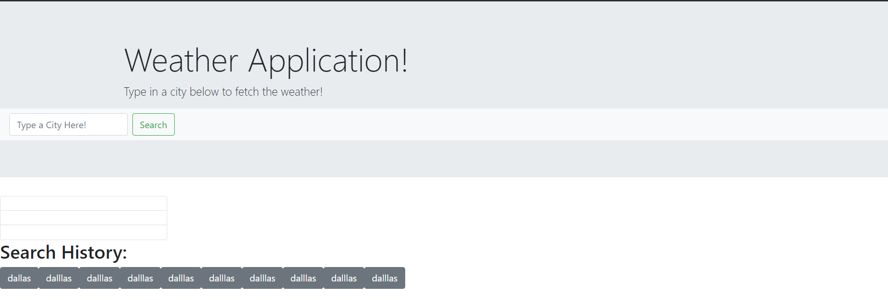

## weather application 
> Weather Application!

## Table of contents
* [General info](#general-info)
* [Screenshots](#screenshots)
* [Setup](#setup)
* [Status](#status)
* [Contact](#contact)

## General info
This is a basic browser web-page that takes a user input from a search bar and uses that input to pull up weather information about a given city.
This web-page also utilizes local storage to save all the user's previous searches.
## Screenshots

## Setup
This program runs in browser. There is no installation needed.

## Code Examples
     var APIkey = "d78d56992b64fee08af8eaafb0a5c15e"
    var queryURL = "https://api.openweathermap.org/data/2.5/weather?q="  + weather + "&appid=" + APIkey 
    // then the browser connects with the weather API
    $.ajax({
      url: queryURL,
      method: "GET"
    }).then(function(response) {

        console.log(response);
     
        // create div to contain all elements 
        
        // based on the city the user entered 
        // store the city name as a variable
        var cityName = response.name
        // add the city name to an h1 tag
        $("<h1>").text(cityName)
        // append the city name to the div
        
        $("#cityName").text("City: ").append(cityName)
        // store the weather as a variable
        var currentWeather = (response.main.temp -273.15)*1.8+32; + " degrees Farenheit"
        // add the weather to an h1 tag
        $("<h1>").text(currentWeather)
        // append the weather to the div
        $("#currentWeather").text("Temperature: ").append(currentWeather)
        // store the wind speed in a vari spped to a h6able
        var windSpeed = response.wind.speed
        // add the wind tag
        $("<h1>").text(windSpeed)
        // sappend the wind spped to the div
        $("#windSpeed").text("Wind Speed: ").append(windSpeed)
        // store the UV index as a variable
        var lon = response.coord.lon
        var lat = response.coord.lat
        console.log(lat)
        $.ajax({
            url: "https://api.openweathermap.org/v3/uvi/" + lat + lon + "/current.json?appid=" + APIkey,
            method: "GET"
        }).then(function(review){
            console.log(review)
            
        })
 
    })

    This is a code block where the weather API is called and the various responses are stored and appended to the HTML.

## Status
Project is in progress. Feel free to email me with any suggestions or to report any bugs: ianmharris93@gmail.com

## Contact
Created by Ian Harris(https://github.com/iannm93) - ianmharris93@gmail.com - feel free to contact me!
